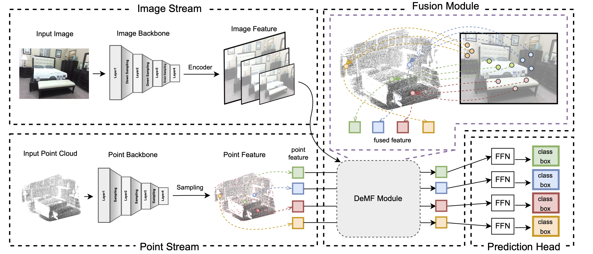

# Boosting 3D Object Detection via Object-Focused Image Fusion

This is a [MMDetection3D](https://github.com/open-mmlab/mmdetection3d) implementation of the paper Yang et al, "Boosting 3D Object Detection via Object-Focused Image Fusion".

> Boosting 3D Object Detection via Object-Focused Image Fusion  
> Hao Yang*, Chen Shi*, Yihong Chen, Liwei Wang 
>

#### [paper]()



## Prerequisites
The code is tested with Python3.7, PyTorch == 1.8, CUDA == 11.1, mmdet3d == 0.18.1, mmcv_full == 1.3.18 and mmdet == 2.14. We recommend you to use anaconda to make sure that all dependencies are in place. Note that different versions of the library may cause changes in results.

**Step 1.** Create a conda environment and activate it.
```
conda create --name demf python=3.7
conda activate demf
```

**Step 2.** Install [MMDetection3D](https://github.com/open-mmlab/mmdetection3d) following the instruction [here](https://github.com/open-mmlab/mmdetection3d/blob/master/docs/en/getting_started.md).

**Step 3.** Prepare SUN RGB-D Data following the procedure [here](https://github.com/open-mmlab/mmdetection3d/tree/master/data/sunrgbd).

## Getting Started
**Step 1.** First we need to train a [Deformable DETR](https://arxiv.org/abs/2010.04159?context=cs) on SUN RGB-D image data to get the checkpoint of image branch.
```shell
python -m torch.distributed.launch --nproc_per_node=$GPUS --master_port=$PORT train.py configs/deformdetr/imvotenet_deform.py --launcher pytorch ${@:3}
```

Or you can download the pre-trained image branch [here](https://drive.google.com/file/d/1H0SGOSvfYU45ID38CvQohIyAUeAXm3Ra/view?usp=sharing).

**Step 2.**
Specify the path to the pre-trained image branch in [config](configs/demf/demf_votenet.py).

**Step 3.** Train our DeMF using the following command.
```shell
python -m torch.distributed.launch --nproc_per_node=8 --master_port=$PORT train.py configs/demf/demf_votenet.py --launcher pytorch ${@:3}
```
We also provide pre-trained DeMF [here](https://drive.google.com/file/d/1s7mOJbz3__qdGLpA10MbK2KLHDIX6rmX/view?usp=sharing). Use eval.py to evaluate the pretrained model and you will get the 65.5mAP@0.25 and 46.1mAP@0.5.
```shell
python -m torch.distributed.launch --nproc_per_node=8 --master_port=$PORT test.py --config configs/demf/demf_votenet.py --checkpoint $CHECKPOINT --eval mAP --launcher pytorch ${@:4}
```

## Todo
We will release the code of the DeMF (Fcaf3d based) soon.

## Citation
If you find this work useful for your research, please cite our paper: